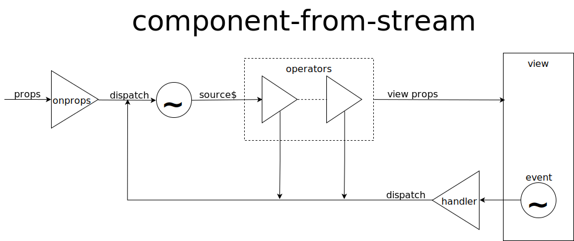

# component-from-stream on steroids (< 1k bytes gzip)
[](https://nodei.co/npm/component-from-stream/)

create a React-like component from any React-compatible library,
that sources its props from an observable stream.

based on [component-from-stream](https://github.com/acdlite/recompose/blob/master/docs/API.md#componentfromstream)
from [recompose](https://npmjs.com/package/recompose),
with the following enhancements:
* compatible with any [`React`](https://reactjs.org)-compatible library,<br/>
so long as it provides a [`React`](https://reactjs.org)-like `Component` class,
e.g. [`PREACT`](https://preactjs.com/) or [`Inferno`](https://infernojs.org/).
* support for operators that may dispatch back into source stream,<br/>
e.g. [`component-from-stream-redux`](https://npmjs.com/package/component-from-stream-redux).<br/>
more info in the [API section](#API).
* support for a custom `props` dispatcher instead of the default dispatcher,<br/>
e.g. to emit [FSAs](https://www.npmjs.com/package/flux-standard-action)
into the [`component-from-stream-redux`](https://npmjs.com/package/component-from-stream-redux) operator.
* [separation](#separation) of stateless view from stateful reactive behaviour.
* life-cycle management and gated rendering from within
the component's reactive behaviour:
  * automatically complete on `componentWillUnmount`.
  * only render when the reactive operator emits a `props` object,<br/>
and render null on falsy values.

compatible with observable libraries such as [`RxJS`](http://reactivex.io/rxjs/)
or [`MOST`](https://www.npmjs.com/package/most)

# <a name="separation"></a> Separation of stateless view from stateful behaviour
the stateless rendering function (the component's view) is separated
from the potentially stateful reactive operator (the component's behaviour)
which maps the component's input stream of `props` to that of its rendering function.

Separation of behaviour from view has many advantages, among which:
* state can typically be confined to within a small subset of behaviours.
* views can be stateless and easily tested separately (e.g. with [storybook](https://storybook.js.org/))
* straightforward unit testing:
  * behaviours operate exclusively within streams of `props` = no DOM involved.
  * unit testing effort can focus on stateful unit behaviours,
  stateless behaviours being straightforward to validate.
* a component's behaviour typically becomes self-documenting.
* behaviours are independent of rendering framework.
* unit behaviours can be shared between components.
* for a given view, an existing component's behaviour can be extended
by composing it with additional unit behaviours.

# Example
see the full [example](./example/index.tsx) in this directory.<br/>
run the example in your browser locally with `npm run example`
or [online here](https://cdn.rawgit.com/ZenyWay/component-from-stream/v0.14.0/example/index.html).

this example demonstrates how to implement `component-from-stream` Components
described in terms of their view and composed behaviour.<br/>
for an example of a redux-like setup, see that in the
[`component-from-stream-redux`](https://npmjs.com/package/component-from-stream-redux)
operator module.

`component-from-stream.ts`
```ts
import createComponentFromStreamFactory, {
  ComponentFromStreamFactory, ComponentFromStreamConstructor
} from '../'
import { InfernoChildren, Component } from 'inferno'
import { from } from 'rxjs'

export { ComponentFromStreamFactory, ComponentFromStreamConstructor, Component, InfernoChildren }

// export a component-from-stream factory based on Inferno and RxJS
export default createComponentFromStreamFactory<Component<any,any>,InfernoChildren>(
  Component,
  from
)
```

`copy-button/index.ts`
```ts
import Button from './view'
import copyButtonBehaviour from './behaviour'
import componentFromStream, {
  ComponentFromStreamConstructor, Component, InfernoChildren
} from '../component-from-stream'

export default componentFromStream(Button, copyButtonBehaviour)
```

`copy-button/behaviour.ts`
```ts
import { shallowEqual, shallowMerge, pick, log } from '../utils'
import { into } from 'basic-cursors'
import withEventHandler from 'rx-with-event-handler'
import { distinctUntilChanged, map, switchMap, tap } from 'rxjs/operators'

export default function (
  props$: Observable<CopyButtonProps>
): Observable<ButtonViewProps> {
  return props$.pipe(
    map(shallowMerge(DEFAULT_PROPS)), // icons are not deep-copied
    tap(log('copy-button:props:')),
    withEventHandler('click')(switchMap(doCopyToClipboard)),
    withToggleDisabledOnSuccess,
    tap(log('copy-button:toggle-disable-on-success:')),
    pickDistinct('disabled', 'onClick', 'icons'), // clean-up
    map(into('icon')(iconFromDisabled)),
    distinctUntilChanged(shallowEqual), // only render when necessary
    tap(log('copy-button:view-props:')),
  )
}

function doCopyToClipboard
<P extends { event: E, value: string }, E extends { payload: MouseEvent }>(
  props: P
): Observable<P & { success: true }> {
  const { event, value } = props
  event.payload.preventDefault()

  return from(copyToClipboard(value)).pipe(
    mapTo({ ...(<object>props), success: true } as P & { success: true }),
    catchError(empty) // do nothing on error
  )
}

function pickDistinct <P={}>(...keys: (keyof P)[]) {
	return function (props$: Observable<P>): Observable<Pick<P, keyof P>> {
    return props$.pipe(map(pick(...keys)), distinctUntilChanged(shallowEqual))
  }
}

function iconFromDisabled ({ disabled, icons }: any) {
  return disabled ? icons.disabled : icons.enabled
}
// ...
```
`withEventHandler('click')` from [`rx-with-event-handler`](https://npmjs.com/package/rx-with-event-handler/)
adds an `onClick` prop and emits the extended `props` object
whenever it receives a new input.
whenever the `onClick` handler is called (from the rendered `Component`),
it also adds an `event` prop to the emitted `props` object,
and pipes the latter through the given event handler operator,
in this case `switchMap(doCopyToClipboard)`,
which copies the `value` prop to the clipboard
and adds a `success` prop set to `true` on success.

the resulting event can then be further processed by a downstream operator,
e.g. `withToggleDisabledOnSuccess`, which toggles the boolean `disabled` prop
for a brief moment whenever the `success` prop turns `true`.
[check the code](./example/copy-button/behaviour.ts#L64-L75)
for implementation details of this operator.

# <a name="API"></a>API


the `component-from-stream` factory is not directly exposed by this module.<br/>
instead, a higher-level factory is exposed for injecting the following dependencies:
* the base `Component` from a [`React`](https://reactjs.org)-like library,
e.g. [`PREACT`](https://preactjs.com/) or [`Inferno`](https://infernojs.org/).
* Observable conversion functions for reactive operator support
from third-party Observable libraries, e.g. [`RxJS`](http://reactivex.io/rxjs/)
or [`MOST`](https://www.npmjs.com/package/most).

this higher-level factory returns the required component factory
after injection of the supplied dependencies.
it is typically only required once in a project,
the resulting `component-from-stream` factory being exposed to the project's
other modules.

the above example illustrates the traditional instatiation of a `component-from-stream`,
with a single reactive operator that maps incoming props to view props.

the component factory may however be given additional optional arguments,
for structuring more complex behaviours into self-documenting code:
* `onprops` dispatcher factory: a factory that returns a custom props dispatcher,
e.g. to add default props, event handlers,
and/or to dispatch an [FSA](https://www.npmjs.com/package/flux-standard-action)
object with props as payload.
* `...operators`: rest arguments are operators
that may dispatch back into source stream.
see the [`component-from-stream-redux`](https://npmjs.com/package/component-from-stream-redux)
middleware module for an example middleware implementation.

```ts
import { Subscribable } from 'rx-subject'
export { Subscribable }

export default function createComponentFromStreamFactory<C extends Component<N, any, any>, N>(
  ComponentCtor: new (props: any, context?: any) => C & Component<N, any, any>,
  fromESObservable: <T, O extends Subscribable<T>>(stream: Subscribable<T>) => O,
  opts?: Partial<ComponentFromStreamOptions>
): ComponentFromStreamFactory<C, N>

export default function createComponentFromStreamFactory<C extends Component<N, any, any>, N>(
  ComponentCtor: new (props: any, context?: any) => C & Component<N, any, any>,
  fromESObservable: <T, O extends Subscribable<T>>(stream: Subscribable<T>) => O,
  toESObservable: <T, O extends Subscribable<T>>(stream: O) => Subscribable<T>,
  opts?: Partial<ComponentFromStreamOptions>
): ComponentFromStreamFactory<C, N>

export interface ComponentFromStreamFactory<C extends Component<N, any, any>, N> {
  <P = {}, Q = P, A = P>(
    render: (props: Q) => N,
    operator: Operator<P, A>
  ): ComponentFromStreamConstructor<C, N>
  <P = {}, Q = P, A = P>(
    render: (props: Q) => N,
    onProps: DispatcherFactory<P, A>,
    ...operators: GenericControlOperator<A>[]
  ): ComponentFromStreamConstructor<C, N>
}

export interface ComponentFromStreamOptions {}

export interface ComponentFromStreamConstructor<C extends Component<N, any, any>, N> {
  new <P = {}, Q = P>(props?: P, context?: any): C & ComponentFromStream<N, P, Q>
}

export interface ComponentFromStream<N, P = {}, Q = P>
extends Component<N, P, PropsState<Q>> {
  componentWillMount(): void
  componentWillReceiveProps(nextProps: Readonly<P>, nextContext: any): void
  componentWillUnmount(): void
  shouldComponentUpdate(props: Readonly<P>, state: Readonly<PropsState<Q>>): boolean
}

export interface ComponentConstructor<N> {
  new <P = {}, S = {}>(props: P, context?: any): Component<N, P, S>
}

export interface Component<N, P = {}, S = {}> {
  setState(state: Reducer<S, P> | Partial<S>, cb?: () => void): void
  render(props?: P, state?: S, context?: any): N | void
  props: Readonly<P>
  state: Readonly<S | null>
  context: any
}

export interface PropsState<Q> {
  props: Q
}

export declare type DispatcherFactory<P, A = P> =
<S extends Subscribable<A>>(dispatch: (v: A) => void) => (props: P) => void

export declare type Operator<I, O> =
<U extends Subscribable<I>, V extends Subscribable<O>>(source$: U) => V

export declare type GenericControlOperator<A> = <
  I,
  O = I,
  S extends Subscribable<I> = Subscribable<I>,
  T extends Subscribable<O> = Subscribable<O>
>(
  source$: S,
  dispatch?: StreamableDispatcher<A>,
  fromESObservable?: <T, O extends Subscribable<T>>(stream: Subscribable<T>) => O,
  toESObservable?: <T, O extends Subscribable<T>>(stream: O) => Subscribable<T>
) => T

export interface StreamableDispatcher<A, S extends Subscribable<A> = Subscribable<A>> {
  next(val: A): void
  from<E extends Subscribable<A>>(source$: E): void
  source$: S
}

export declare type Reducer<A, V> = (acc: A, val: V) => A

export declare function identity<T>(v: T): T
```

# `Symbol.observable`
This module expects `Symbol.observable` to be defined in the global scope.
Use a polyfill such as [`symbol-observable`](https://npmjs.com/package/symbol-observable/)
and if necessary a `Symbol` polyfill.
Check the [`symbol-observable-polyfill` script](./package.json#L10)
for an example of how to generate the standalone polyfill,
which can than be [loaded from a script tag](./example/index.html#L27),
or simply add `import 'symbol-observable'` at the top of your project's main file.

# TypeScript
although this library is written in [TypeScript](https://www.typescriptlang.org),
it may also be imported into plain JavaScript code:
modern code editors will still benefit from the available type definition,
e.g. for helpful code completion.

# License
Copyright 2018 Stéphane M. Catala

Licensed under the Apache License, Version 2.0 (the "License");
you may not use this file except in compliance with the License.
You may obtain a copy of the License at

    http://www.apache.org/licenses/LICENSE-2.0

Unless required by applicable law or agreed to in writing, software
distributed under the License is distributed on an "AS IS" BASIS,
WITHOUT WARRANTIES OR CONDITIONS OF ANY KIND, either express or implied.
See the [License](./LICENSE) for the specific language governing permissions and
Limitations under the License.

